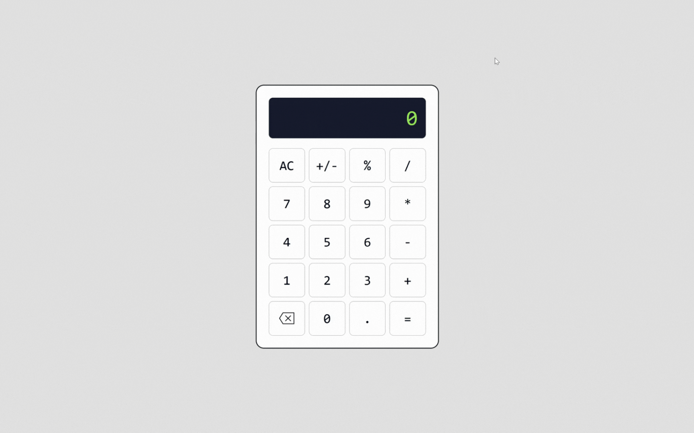

# 🧮 Calculator App

A simple and responsive calculator built with **HTML**, **CSS**, and **JavaScript**, inspired by classic handheld calculators. This project is part of [The Odin Project's](https://www.theodinproject.com/) curriculum.

🔗 **Live Site:** [dani-sink.github.io/project-calculator](https://dani-sink.github.io/project-calculator/)

## 🎬 Demo



## ✨ Features

- Basic arithmetic: addition, subtraction, multiplication, and division
- All Clear and delete functionality
- Keyboard input support
- Mouse click support
- Responsive layout for desktop and mobile
- Handles edge cases such as division by zero

## 🧰 Tech Stack

- **HTML** – Structure of the calculator
- **CSS** – Styling and responsive layout
- **JavaScript** – Functional logic and event handling

## 🚀 Getting Started

To run the calculator locally:

1. Clone this repo:
   ```bash
   git clone https://github.com/dani-sink/project-calculator.git
   ```
2. Navigate to the project folder:
   ```bash
   cd project-calculator
   ```
3. Open `index.html` in your browser.

## 🔧 Future Improvements

- Add scientific calculator mode
- Improve keyboard navigation accessibility
- Add sound or animation feedback on interaction
- Support dark mode

## 🙌 Acknowledgments

- [The Odin Project](https://www.theodinproject.com/) for the project inspiration and guidance

## 👨‍💻 Author

**Jean-Daniel Sinkpon**  
📬 [danielsinkpon@gmail.com](mailto:danielsinkpon@gmail.com)  
🔗 [GitHub](https://github.com/dani-sink) | [LinkedIn](https://linkedin.com/in/daniel-sinkpon)

---

Feel free to fork, star, or contribute to this project!
